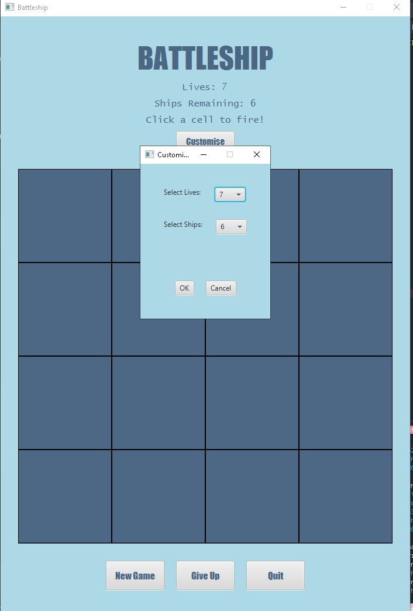
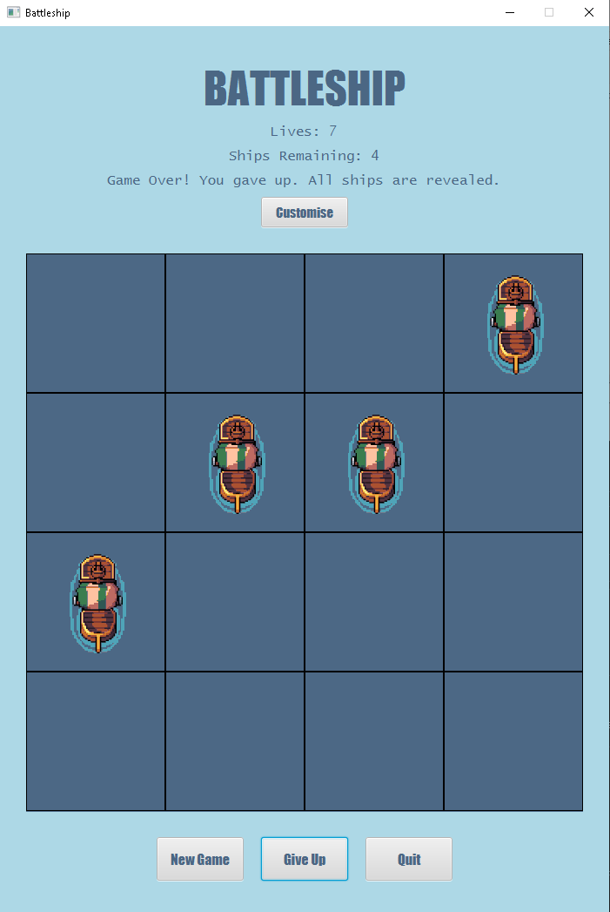
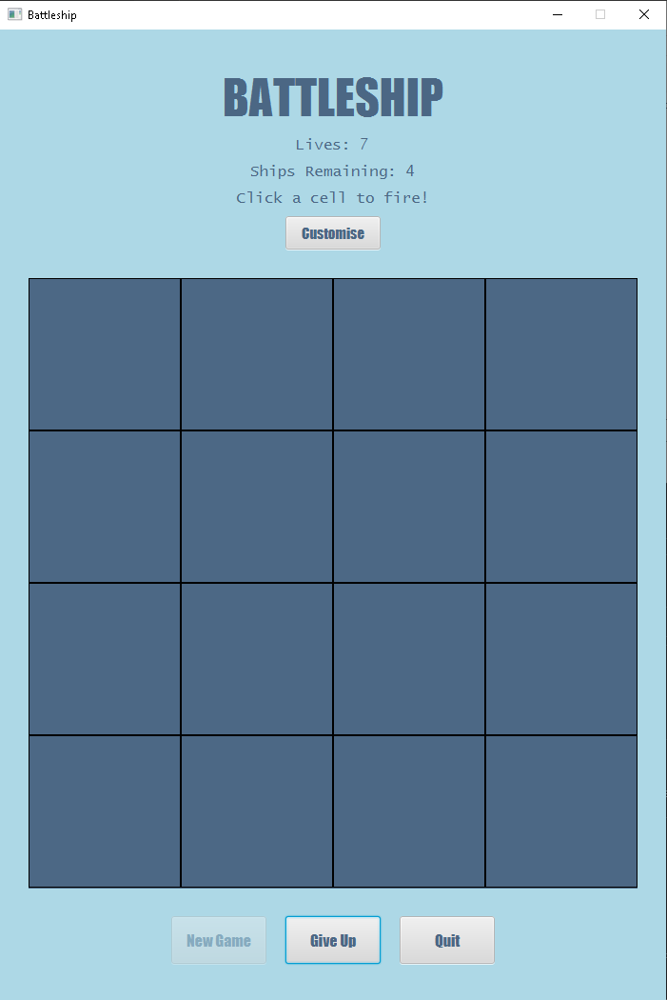
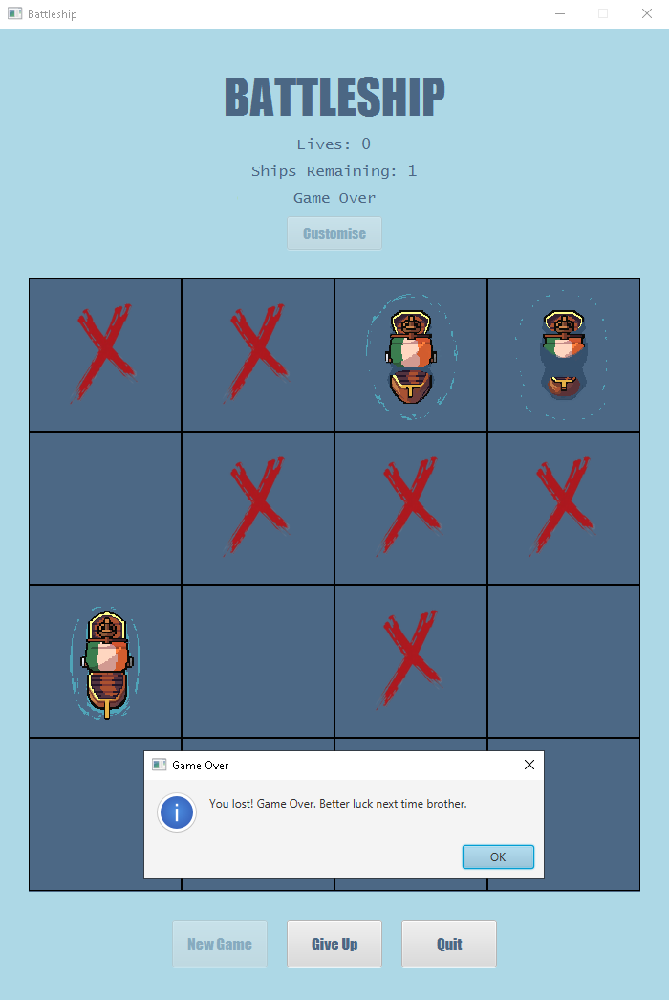

# 🚢 Battleship Game (JavaFX)

> 🎯 A modern version of the classic **Battleship** strategy game, built entirely with **JavaFX**.  
> Designed as a university project to demonstrate **object-oriented programming**, **GUI design**, and **JavaFX event handling**.

---

## ✨ Features

🟦 Interactive grid-based gameplay  
🧠 Smart logic for hits, misses, and ship placement  
🎨 Custom UI styling via `style.css`  
🪟 Fully graphical interface (JavaFX)  
🎯 Dynamic button hover effects & color theming  
💬 Real-time player feedback and game status  
🧩 Modular class design for easy expansion  

---

## 🗂️ Project Structure
```
Battleship Game/
│
├── BattleshipsGUI.java # Main GUI class (JavaFX Application)
├── BattleshipsGame.java # Core game logic
├── BattleshipCell.java # Represents an individual cell
├── BattleshipTester.java # Test / console runner
├── style.css # JavaFX custom styles
└── README.md # This file
```
---

## ⚙️ Requirements

| Tool | Version | Notes |
|------|----------|-------|
| ☕ Java | 17 or higher | Tested on JDK 23 |
| 🎨 JavaFX SDK | 25.0.1 | [Download here](https://gluonhq.com/products/javafx/) |
| 🧩 IDE | VS Code / IntelliJ / Eclipse | With JavaFX configured |

---

## 🚀 How to Run

### 🧭 Step 1 — Setup JavaFX SDK

1. Download JavaFX SDK (25.0.1) and extract to:
    C:\javafx-sdk-25.0.1

2. Ensure the folder contains:
    C:\javafx-sdk-25.0.1\lib\javafx.controls.jar
    C:\javafx-sdk-25.0.1\lib\javafx.fxml.jar


---

### 💻 Step 2 — Compile and Run from Terminal

```bash
cd "C:\Users\<yourname>\CODING PROJECTS\University Projects\Battleship Game"

javac --module-path "C:\javafx-sdk-25.0.1\lib" --add-modules javafx.controls,javafx.fxml *.java

java --module-path "C:\javafx-sdk-25.0.1\lib" --add-modules javafx.controls,javafx.fxml BattleshipsGUI
```

## ▶️ Step 3 — Run in VS Code

Add this config inside `.vscode/launch.json`:

```json
{
  "type": "java",
  "name": "BattleshipsGUI (JavaFX)",
  "request": "launch",
  "mainClass": "BattleshipsGUI",
  "vmArgs": "--module-path \"C:\\javafx-sdk-25.0.1\\lib\" --add-modules javafx.controls,javafx.fxml"
}
```
Then:
1. Open the Run & Debug panel (Ctrl + Shift + D)
2. Select BattleshipsGUI (JavaFX)
3. Click ▶️ Run

---

## ⚙️ Manual Run Instructions (Alternative)

If the **Run ▶️** button in VS Code doesn’t work, you can compile and run the project manually from a terminal.

### 🧭 Step 1 — Navigate to the project folder
```bash
cd "C:\Projects\Battleship-Game"
```
### ⚙️ Step 2 — Compile all Java files

```bash
javac --module-path "C:\javafx-sdk-25.0.1\lib" --add-modules javafx.controls,javafx.fxml,javafx.graphics *.java
```

### 🚀 Step 3 — Run the main program

```bash
java --module-path "C:\javafx-sdk-25.0.1\lib" --add-modules javafx.controls,javafx.fxml,javafx.graphics BattleshipsGUI
```
This will open the Battleship GUI window.

#### ⚡ One-Line Shortcut
You can compile and run in a single command:
```bash
javac --module-path "C:\javafx-sdk-25.0.1\lib" --add-modules javafx.controls,javafx.fxml,javafx.graphics *.java && java --module-path "C:\javafx-sdk-25.0.1\lib" --add-modules javafx.controls,javafx.fxml,javafx.graphics BattleshipsGUI
```
---

## 🎨 UI Styling (style.css)
JavaFX CSS gives the interface a sleek, modern look:
```
.grid-button {
   -fx-pref-width: 160px;
   -fx-pref-height: 160px;
   -fx-background-color: #4c6885;
   -fx-border-color: black;
}
.grid-button:hover {
   -fx-background-color: #295B8C;
   -fx-cursor: hand;
}
```
🖌️ Typography and colors were chosen to reflect a **naval theme** with deep blue tones.

---

## 🧠 Concepts Demonstrated

- JavaFX GUI Framework (Scenes, Layouts, Events)  
- Object-Oriented Programming (Encapsulation, Classes)  
- Event-Driven Logic (Buttons, Listeners)  
- Grid Management & Cell State Tracking  
- JavaFX CSS Styling  
- Modular & Readable Code Design  

---

## 📸 Screenshots

| 🧩 Customise Screen | 🏳️ Give Up Button | 🎮 New Game | 🚢 Gameplay |
|----------------------|-------------------|-------------|-------------|
|  |  |  |  |


---

## 👩‍💻 Author

**Desiree Payoyo**  
🎓 BSc Computer Science — Atlantic Technological University (ATU) Donegal  
💼 Interests: Web & App Development | Java | UI/UX Design  


 
